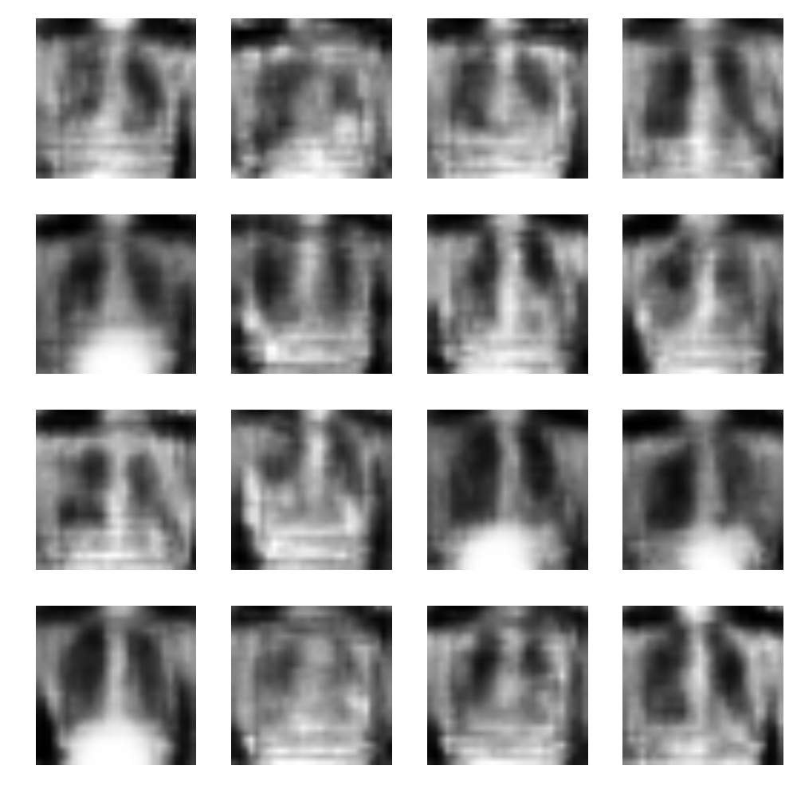

# RaGAN: Radiology GAN

## Machine Learning based production of training images to use in image analysis workflow

##### Hackathon team: Xinlian Liu (lead), Yanling Liu (lead), Samar Samarjeet (platform), Chun-Hung Lin (deployment)

### Introduction

High quality delineation of important features is a critical component in biomedical image interpretation for accurate diagnosis and/or assessment of a disease. Convolutional Neural Networks (CNNs) based Deep Learning (DL) techniques have been proven highly successful in image classification and segmentation tasks by utilizing large number of training images, potentially promising higher throughput and more consistent results in biomedical image interpretation. Computerized tools enhanced by DL are rapidly proving to be a state-of-the-art solution toward improved accuracy in biomedical image interpretation. Furthermore, researchers have reported successful training of Generative Adversarial Network (GAN) models to generate synthetic training images as potential solutions to solve the scarcity of training sets.

The following diagram shows the basic concept of GAN network. In the picture, the generator tries to produce synthetic images to fool the discriminator where as the discriminator tries to tell synthetic images from real images. 


[image source](https://mlnotebook.github.io/img/CNN/gan1.png)

### Current Challenges

Training a CNN for Deep Learning typically requires a large amount of labeled training image data, which remains a challenge in the biomedical domain because of the expense of expert annotation. Although researchers have reported successful training of Generative Adversarial Network (GAN) models to generate synthetic images as a potential solution to solve the training set bottleneck, training CNNs and GANs in a timely manner could require demanding programming experience and skill sets from domain experts. Our aim is to provide end users a streamlined workflow to facilitate rapid utilization of GAN networks to produce synthetic radiology images for DL training.

### Methods

We firstly ported a GAN network implementation to tensorFlow for wider and easier adoption.
Secondly we wrapped the GAN implementation as a python module such that users can start GAN training for synthetic training in a few lines of code.
Finally we containerized the workflow such that users are freed from tedious software environment setup just in order to start DL training.

### Usage

#### Description of the GAN network architecture

##### Instructions on how to use our workflow are here…

GAN network architecture, figures, etc.

1. Python ‘regan’ library
We implemented a cookiecutter-template based development pipeline for the project. Users can download the project from github and use the following command 
```
python setup.py build
python setup.py install
```

The library will be installed in the "site-packages" directory of the python installation.
To use the library, users must just use 

```
import ragan
```
in their python script.

We are also making it conda installable project. To install the project, users will have to just use
```
conda install ragan -c ragan
```
to install the project. 

2. Docker <br>
We use a tool called Docker, which can package all our works including code and enviroment in one docker image.
Thanks to Containerization, you can use our tools without many setup steps. Just follow the instruction below :
```
docker pull johnbamboobilly/ragan
```
https://hub.docker.com/r/johnbamboobilly/ragan/ is our repository on dockerhub
```
docker image ls
```
check the <IMAGE ID> in the list, and copy <IMAGE ID> just pulled down
```
docker run <IMAGE ID>
```
replace <IMAGE ID> with the id you saw on the list

#### Instructions

* Instructions to build, install, and use the ‘regan’ library

* Instructions to use the docker version (the python library warped in the docker container for easier usage, for example, the container has all necessary libraries so users don’t have to setup environments on their own computers (they only need a GPU and video card driver)

#### Use cases:


Data source: CXR8

#### Long Term Goals:

* Explore alternatives network architectures for performance enhancement
* 3D capacity
* Build more use cases

This repository reflects our efforts at the NCBI Hackathon (Bethesda, MD) Sept 10-12, 2018. 


##### Team members:
* Xinlian Liu, FNLCR
* Yanling Liu, FNLCR
* Samar Samarjeet, NIH
* Chun-Hung Lin, USDA
